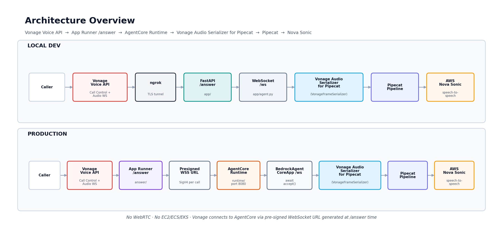

# Deploying a Real-Time AI Agent for Voice Calls with Vonage and AWS AgentCore

The Vonage Audio Serializer for Pipecat is designed for audio-only AI use cases across both Vonage Voice API and Video API. It is the simplest path to a working agent and the right choice when you don't need video frame processing. If you need full video frame processing or video avatars, see Part 1 which covers the [Vonage Video Transport for Pipecat](https://developer.vonage.com/en/video/guides/vonage-pipecat-serializer-overview).

Developers can now deploy AI agents directly into live phone calls. Instead of static IVR menus or scripted bots, you can build AI agents that listen, respond naturally, and take real-world actions — all over a standard Vonage phone call.

In this tutorial, you'll deploy an AI agent for voice calls using the Vonage Audio Serializer for Pipecat and AWS Nova Sonic. The Vonage Audio Serializer for Pipecat is Vonage's integration that bridges real-time voice and video sessions into AI pipelines over WebSocket. AWS Nova Sonic is optimized for low-latency conversational voice interactions, eliminating the traditional STT → LLM → TTS chain with a single speech-to-speech model.

This tutorial uses the **Vonage Audio Serializer for Pipecat** — the Pipecat plugin (`VonageFrameSerializer`) that connects to the Vonage Voice WebSocket and converts PCM audio frames between Vonage's WebSocket format and Pipecat's internal pipeline format. For Voice Calls, the Vonage Voice WebSocket connects directly to the Audio Serializer; no separate Audio Connector Server SDK is required.

You'll use:

- **Vonage Voice API** for telephony — Call Control (NCCO) and Audio WebSocket (PCM streaming)
- **Vonage Audio Serializer for Pipecat** (`VonageFrameSerializer`) for audio frame conversion
- **AWS Nova Sonic** for speech-to-speech voice AI
- **AWS Bedrock AgentCore Runtime** for managed production deployment, tool use, and RAG

Skip ahead and find the working code for this sample on [GitHub](https://github.com/nexmo-se/vonage-pipecat-serializer-voice-aws-agentcore).

## What You'll Build

By the end of this tutorial, you'll have:

- An AI agent deployed inside **AWS Bedrock AgentCore Runtime** — a fully managed serverless container that runs your Pipecat pipeline
- A public **App Runner** endpoint that handles the Vonage `/answer` webhook and returns a pre-signed AgentCore WebSocket URL
- Real-time spoken AI responses using **AWS Nova Sonic** (speech-to-speech, no STT/TTS chain)
- A production architecture that requires no EC2, no ECS, no ALB — just `agentcore deploy` and an App Runner service

## Prerequisites

Before you begin, make sure you have the following:

- A Vonage API account with Voice API enabled and a phone number linked to a Voice application
- An AWS account with Amazon Bedrock access and Nova Sonic (`amazon.nova-2-sonic-v1:0`) enabled in `us-east-1`
- **Python 3.12** — required for **AgentCore Runtime** (`runtime/`). The `aws_sdk_bedrock_runtime` package is only distributed for Python 3.12+; Python 3.11 installs silently but crashes at runtime. Local `app/` uses Python 3.13 via Docker.
- Docker Desktop — the app runs in Docker for an isolated, reproducible runtime
- ngrok with a reserved domain for a stable Vonage webhook URL during local development
- AWS CLI configured (`aws configure --profile vonage-dev`) with Bedrock access in `us-east-1`
- `bedrock-agentcore-starter-toolkit` CLI (`pip install bedrock-agentcore-starter-toolkit`) for runtime deployment
- Vonage Voice application with a public Answer URL (inbound webhook flow — no Vonage credentials needed on the agent side)

Don't have a Vonage account yet? [Sign up for free](https://developer.vonage.com). No AWS account? [Create one here](https://aws.amazon.com).

## This Is Part 2 of a Two-Part Series

Part 1 covered the [Vonage Video Transport for Pipecat](https://developer.vonage.com/en/video/guides/vonage-pipecat-serializer-overview) — a WebRTC-based path for AI agents that join Vonage Video sessions as native participants.

This post covers the Vonage Audio Serializer for Pipecat — a WebSocket-based path for voice/telephony use cases. The official Vonage docs summarize the relationship between the two integrations:

> Use the Audio Serializer when you need Voice API support or want the simplest path to a working agent. Use the Video Transport when you need full video frame processing or the lowest possible WebRTC latency.

|                         | [Vonage Audio Serializer for Pipecat](https://developer.vonage.com/en/voice/voice-api/guides/vonage-audio-serializer-for-pipecat-overview) (this post) | [Vonage Video Transport for Pipecat](https://developer.vonage.com/en/video/guides/vonage-pipecat-serializer-overview) (Part 1) |
| ----------------------- | ---------------------------- | ------------------------ |
| Protocol                | WebSocket                    | WebRTC                   |
| Voice API (phone calls) | ✅ Yes                       | ❌ No                    |
| Video API               | ✅ Yes — via Audio Connector | ✅ Yes                   |
| Full video frames       | ❌ Audio only                | ✅ Audio + Video         |
| Docker required         | ✅ Yes                       | ✅ Yes                   |
| Status                  | ✅ GA                        | ✅ GA                    |

## Why This Stack?

| Layer | What it does | Why it matters |
| --- | --- | --- |
| **Vonage Voice API (Call Control)** | Handles incoming calls via NCCO — returns the WebSocket URI to Vonage | Standard telephony entry point — no SIP or media gateway needed |
| **Vonage Voice API (Audio WebSocket)** | Streams PCM audio from the live call to your server over WebSocket | Raw 16kHz PCM audio delivered directly to your server in real time |
| **[Vonage Audio Serializer for Pipecat](https://developer.vonage.com/en/voice/voice-api/guides/vonage-audio-serializer-for-pipecat-overview)** | Connects to the Vonage Audio WebSocket and converts Vonage PCM frames to/from Pipecat's internal format | The bridge between Vonage telephony and the Pipecat AI pipeline |
| **[Amazon Nova Sonic](https://aws.amazon.com/bedrock/nova/)** | Speech-to-speech (S2S) AI — voice in, voice out | Improves latency over the traditional STT → LLM → TTS chained approach |
| **[Amazon Bedrock](https://aws.amazon.com/bedrock/)** | Runs Nova Sonic model inference | The model layer — Bedrock answers |
| **[Amazon Bedrock AgentCore](https://docs.aws.amazon.com/bedrock-agentcore/latest/devguide/what-is-bedrock-agentcore.html)** | Production runtime for deploying and scaling your agent — adds tool use, RAG, and external API access on top of Nova Sonic's model inference | AgentCore runs your deployable agent logic. Built on the same underlying framework as Bedrock Agents, but with full developer control. Without AgentCore: a smart assistant limited to model intelligence. With AgentCore: an agent that can query your knowledge base, call an external API, look up a CRM record — all over a live phone call |

> **Note:** AgentCore is the underlying framework that Bedrock Agents is itself built on — using AgentCore directly gives you full developer control over agent logic, any framework, and any model, without the higher-level abstractions of Bedrock Agents.

## Architecture Overview



_Architecture overview: Vonage Voice API → App Runner /answer → AgentCore Runtime → Vonage Audio Serializer for Pipecat (VonageFrameSerializer) → Pipecat Pipeline → AWS Nova Sonic. LOCAL DEV and PRODUCTION flows shown side by side — no WebRTC._

```
LOCAL DEV
Vonage Voice Call
  ↓ GET /answer
ngrok → app/main.py /answer (port 8000)
  ↓ returns NCCO with wss://your-reserved-domain.ngrok.app/ws
Vonage connects to app/main.py /ws
  ↓
app/agent.py
  ↓ VonageFrameSerializer + FastAPIWebsocketTransport
  ↓
Pipecat Pipeline → Amazon Nova Sonic

PRODUCTION
Caller dials Vonage number
  ↓
Vonage Voice API
  ↓ GET /answer → App Runner answer/server.py /answer
    AgentCoreRuntimeClient.generate_presigned_url()
    → returns NCCO with wss://bedrock-agentcore.../runtimes/{arn}/ws?...
  ↓ Vonage connects via pre-signed WebSocket URL
AgentCore Runtime (runtime/agent.py, port 8080)
  ↓ BedrockAgentCoreApp @app.websocket /ws
  ↓ await websocket.accept()  ← required — BedrockAgentCoreApp does not auto-accept
VonageFrameSerializer + FastAPIWebsocketTransport
  ↓
Pipecat Pipeline → AWS Nova Sonic
  ↓
Audio response streams back to caller
```

## Step 1 — Clone the Repository

```bash
git clone https://github.com/nexmo-se/vonage-pipecat-serializer-voice-aws-agentcore.git
cd vonage-pipecat-serializer-voice-aws-agentcore
```

The repository layout:

```text
vonage-pipecat-serializer-voice-aws-agentcore/
├── app/                 # LOCAL DEV — FastAPI (main.py, agent.py), port 8000
├── runtime/             # PRODUCTION — BedrockAgentCoreApp, port 8080, direct code deploy
│                        #   no Dockerfile; .bedrock_agentcore.yaml (gitignored)
├── answer/              # PRODUCTION — App Runner /answer handler, port 3000
│   ├── answer.py        #   presigned URL + NCCO logic
│   ├── server.py        #   FastAPI wrapper (GET /, GET /answer)
│   └── Dockerfile       #   python:3.12-slim
├── blog/                # Tutorial draft (this file)
├── images/              # Architecture diagrams
├── docker-compose.yml
├── .env.example
└── README.md            # Full deployment guide
```

## Step 2 — Set Up Your Environment

> **Security note:** Always use IAM roles or temporary credentials in production. Never hardcode AWS secrets in your code or commit them to version control.

```bash
cp .env.example .env
touch private.key   # docker-compose mounts this file; content not needed for inbound calls
```

Open `.env` and fill in your credentials. For the inbound webhook flow, `AWS_PROFILE`, `BEDROCK_MODEL_ID`, and `BEDROCK_INITIAL_USER_MESSAGE` (recommended) are the essentials — `VONAGE_APPLICATION_ID` and `VONAGE_PRIVATE_KEY` are optional and used by tests only:

```bash
# Vonage Voice API
VONAGE_APPLICATION_ID=your-vonage-application-id
VONAGE_PRIVATE_KEY=private.key
VONAGE_NUMBER=+14155551234
VONAGE_CALL_ID=your-vonage-call-id          # local/tests only

# AWS
AWS_PROFILE=vonage-dev
AWS_REGION=us-east-1
BEDROCK_MODEL_ID=amazon.nova-2-sonic-v1:0
BEDROCK_CONNECT_TIMEOUT_SECONDS=10
BEDROCK_READ_TIMEOUT_SECONDS=60
BEDROCK_MAX_ATTEMPTS=4
BEDROCK_VALIDATE_MODEL_ID=true

# AgentCore
AGENTCORE_AGENT_ARN=arn:aws:bedrock-agentcore:us-east-1:123456789012:runtime/your-runtime-id   # local bootstrap (optional)
AGENTCORE_RUNTIME_ARN=arn:aws:bedrock-agentcore:us-east-1:123456789012:runtime/your-runtime-id  # production /answer webhook

# Nova Sonic session guard
NOVA_SESSION_WARN_SECONDS=410
NOVA_SESSION_LIMIT_SECONDS=470
NOVA_SESSION_STOP_ON_LIMIT=false

# Agent behavior (local dev via .env; production via runtime/agent.py defaults)
BEDROCK_SYSTEM_INSTRUCTION=You are a helpful voice assistant. Respond warmly and briefly.
BEDROCK_INITIAL_USER_MESSAGE=Hello! How can I help you today?
AGENTCORE_BOOTSTRAP_PROMPT=Provide one short greeting plus one helpful follow-up question for a live voice assistant session.

# App
PORT=8000
```

Configure your AWS profile:

```bash
aws configure --profile vonage-dev
export AWS_PROFILE=vonage-dev
aws sts get-caller-identity --profile vonage-dev
```

> **Note:** The production webhook flow does not require `VONAGE_CALL_ID` or Vonage app credentials on the agent side. Vonage calls `/answer`, receives the NCCO, then connects media to the WebSocket URI automatically.

Start the local agent:

```bash
docker compose --profile app up --build app
ngrok http --domain=your-reserved-domain.ngrok.app 8000
# Set Vonage Answer URL → https://your-reserved-domain.ngrok.app/answer
```

## Step 3 — Build the Vonage Audio Serializer Pipeline

`app/agent.py` (local dev) and `runtime/agent.py` (production) implement the voice pipeline — one instance per inbound Vonage WebSocket connection. The Vonage Audio Serializer for Pipecat handles all PCM audio frame conversion between Vonage's WebSocket format and Pipecat's internal pipeline format.

```python
from pipecat.audio.vad.silero import SileroVADAnalyzer
from pipecat.pipeline.pipeline import Pipeline
from pipecat.pipeline.runner import PipelineRunner
from pipecat.pipeline.task import PipelineParams, PipelineTask
from pipecat.serializers.vonage import VonageFrameSerializer
from pipecat.services.aws.nova_sonic.llm import AWSNovaSonicLLMService, Params
from pipecat.transports.websocket.fastapi import (
    FastAPIWebsocketParams,
    FastAPIWebsocketTransport,
)

# Vonage telephony-grade audio framing: 640 bytes = 20ms @ 16kHz PCM16 mono
# 16kHz is the standard sample rate used in this tutorial. The Vonage Voice WebSocket
# also supports 8kHz and up to 24kHz, but 16kHz is the recommended default for Nova Sonic.
serializer = VonageFrameSerializer(
    params=VonageFrameSerializer.InputParams(
        vonage_sample_rate=16000,
    )
)

transport = FastAPIWebsocketTransport(
    websocket=websocket,
    params=FastAPIWebsocketParams(
        audio_in_enabled=True,
        audio_out_enabled=True,
        add_wav_header=False,
        fixed_audio_packet_size=640,  # 20ms PCM frame at 16kHz
        serializer=serializer,
        vad_analyzer=SileroVADAnalyzer(),
    ),
)

# AWS Nova Sonic — speech-to-speech AI
nova_sonic = AWSNovaSonicLLMService(
    access_key_id=frozen_credentials.access_key,
    secret_access_key=frozen_credentials.secret_key,
    session_token=frozen_credentials.token,
    region=aws_region,
    model=bedrock_model_id,
    params=Params(
        input_sample_rate=16000,
        input_channel_count=1,
        output_sample_rate=16000,
        output_channel_count=1,
    ),
    system_instruction=system_instruction,
)

# 3-stage speech-to-speech pipeline
pipeline = Pipeline([
    transport.input(),      # Audio in from Vonage phone call
    nova_sonic,             # Speech-to-speech AI processing
    transport.output(),     # Audio out back to caller
])
```

> **Note:** 16kHz is the standard sample rate used in this tutorial. The Vonage Voice WebSocket also supports 8kHz and up to 24kHz, but 16kHz is the recommended default for Nova Sonic.

## Step 4 — Deploy Your Agent with AgentCore

AgentCore is AWS Bedrock's managed runtime for deploying and scaling AI agents in production — without managing servers or container infrastructure yourself. It is **generally available (GA)**.

In this project, AgentCore is the **runtime host** — the entire Pipecat agent runs inside AgentCore Runtime. This is not a bootstrap layer or an optional add-on. The agent lives in AgentCore.

**How Bedrock and AgentCore work together:**

| Service | Role |
| --- | --- |
| Amazon Bedrock (Nova Sonic) | Runs model inference for live speech-to-speech conversation |
| Amazon Bedrock AgentCore | Production runtime that hosts your deployable agent — handles infrastructure, scaling, and WebSocket routing |

Short version: **Bedrock answers. AgentCore runs your agent.**

**How it works in this app:**

When a Vonage call comes in, App Runner handles the `/answer` webhook, generates a fresh pre-signed AgentCore WebSocket URL, and returns it in the NCCO. Vonage connects directly to AgentCore Runtime using that URL. AgentCore routes the connection to your agent's `/ws` handler where `VonageFrameSerializer` and the Pipecat pipeline take over.

The `runtime/agent.py` file is your production agent — it runs **inside** AgentCore Runtime. It is not a caller of AgentCore; it **is** the AgentCore-hosted service.

Key structural differences between local and production:

| | Local (`app/`) | Production (`runtime/`) |
| --- | --- | --- |
| App wrapper | `FastAPI()` in `main.py` | `BedrockAgentCoreApp()` in `agent.py` |
| Pipeline | `agent.py` (`VonageSerializerVoiceAgent`) | `agent.py` (`_VoiceAgent`) |
| Port | 8000 | **8080** (AgentCore requirement) |
| `/answer` endpoint | `main.py` | Removed — App Runner handles it |
| AWS credentials | `AWS_PROFILE` / `.env` | **IMDS automatic** — no static keys |
| AgentCore bootstrap | optional local call | **removed** — agent IS in AgentCore |

```python
# runtime/agent.py — runs inside AgentCore Runtime
from bedrock_agentcore.runtime import BedrockAgentCoreApp
from starlette.websockets import WebSocket

app = BedrockAgentCoreApp()

@app.websocket
async def ws_handler(websocket: WebSocket, context) -> None:
    await websocket.accept()  # mandatory — BedrockAgentCoreApp does not auto-accept
    # VonageFrameSerializer + FastAPIWebsocketTransport + Nova Sonic pipeline run here
```

> **Note:** `await websocket.accept()` must be called explicitly. `BedrockAgentCoreApp` does not auto-accept WebSocket connections — omitting it causes AgentCore to close the connection with error 1008 "write buffer limit exceeded".

Customize the greeting and persona in `runtime/agent.py` before deploying — edit the `BEDROCK_SYSTEM_INSTRUCTION` and `BEDROCK_INITIAL_USER_MESSAGE` defaults (e.g. nurse triage, support desk). Greeting changes require a runtime redeploy via `agentcore deploy`, not App Runner. Do **not** put greeting or persona logic in `answer/` — that handler only generates the presigned URL and NCCO. Queue `LLMRunFrame()` on `on_client_connected` to prevent Nova Sonic 532 timeout.

**Deploy your agent to AgentCore:**

```bash
python3 -m venv .venv
source .venv/bin/activate
pip install bedrock-agentcore-starter-toolkit

cd runtime/

# First-time setup — creates .bedrock_agentcore.yaml (gitignored)
agentcore configure \
  -e agent.py \
  -r us-east-1 \
  -n your_agent_name \
  --non-interactive \
  --deployment-type direct_code_deploy \
  --runtime PYTHON_3_12 \
  -rf requirements.txt

# First deploy
AWS_PROFILE=vonage-dev agentcore deploy -a your_agent_name

# Redeploy after code changes (e.g. greeting updates)
AWS_PROFILE=vonage-dev agentcore deploy -a your_agent_name --auto-update-on-conflict
```

Copy the **Runtime ARN** from the deploy output and set it as `AGENTCORE_RUNTIME_ARN` in App Runner environment variables.

Your agent is now running in AgentCore. Vonage connects directly to AgentCore's `/ws` endpoint via the pre-signed URL — no EC2, ECS, or EKS needed.

> **Important:** Use **Python 3.12** (`PYTHON_3_12`). The `aws_sdk_bedrock_runtime` package is only available for Python 3.12+. Python 3.11 installs silently and crashes at runtime with `ModuleNotFoundError`.

**Deploy the App Runner `/answer` handler:**

App Runner handles the Vonage Answer URL webhook. It generates a fresh pre-signed AgentCore WebSocket URL for each call and returns it in the NCCO:

```python
# answer/answer.py
from bedrock_agentcore.runtime import AgentCoreRuntimeClient
import uuid

client = AgentCoreRuntimeClient(region="us-east-1")

def get_presigned_url(runtime_arn: str) -> str:
    return client.generate_presigned_url(
        runtime_arn,
        session_id=str(uuid.uuid4()),  # unique session per call
    )
```

> **Important:** Do NOT use raw boto3 `generate_presigned_url('invoke_agent_runtime', ...)`. That produces an HTTPS POST URL which returns HTTP 405 for WebSocket upgrade. Use `AgentCoreRuntimeClient` from `bedrock_agentcore.runtime`.

```bash
# Build and push to ECR
docker build --platform linux/amd64 -t vonage-agentcore-answer ./answer
docker push {account}.dkr.ecr.us-east-1.amazonaws.com/vonage-agentcore-answer:latest

# App Runner environment variables:
# AGENTCORE_RUNTIME_ARN = <runtime-arn-from-agentcore-deploy>
# VONAGE_NUMBER = <your-vonage-number>
# AWS_DEFAULT_REGION = us-east-1
```

Set your Vonage Voice application's **Answer URL** to your App Runner endpoint:

```text
https://{service-id}.us-east-1.awsapprunner.com/answer
```

See the root [README.md](../README.md) for complete App Runner deployment steps (Docker → ECR → `aws apprunner create-service`).

## Step 5 — Make a Test Call

Call your Vonage number. When Vonage sends a `GET /answer` request, App Runner generates a fresh pre-signed AgentCore WebSocket URL and returns it in the NCCO:

```json
[
  {
    "action": "connect",
    "from": "VONAGE_NUMBER",
    "endpoint": [
      {
        "type": "websocket",
        "uri": "wss://bedrock-agentcore.us-east-1.amazonaws.com/runtimes/{arn}/ws?X-Amz-Algorithm=...",
        "content-type": "audio/l16;rate=16000"
      }
    ]
  }
]
```

> **Why does the NCCO point to AgentCore directly?**
> App Runner generates a fresh SigV4 pre-signed URL at answer time — Vonage connects immediately using that URL. The pre-signed URL expires in 300 seconds but the WebSocket connection persists for the full call duration once established. App Runner handles the AWS authentication; Vonage just uses the URL.

**For local development**, the NCCO points to your local server via ngrok instead:

```json
[
  {
    "action": "connect",
    "endpoint": [
      {
        "type": "websocket",
        "uri": "wss://your-reserved-domain.ngrok.app/ws",
        "content-type": "audio/l16;rate=16000"
      }
    ]
  }
]
```

> Local `app/main.py` omits the `from` field. Production `answer/answer.py` includes `"from": VONAGE_NUMBER`.

**The full call flow:**

1. Caller dials your Vonage number
2. Vonage sends `GET /answer` to App Runner
3. App Runner calls `AgentCoreRuntimeClient.generate_presigned_url()` — generates fresh pre-signed AgentCore WSS URL
4. App Runner returns NCCO with pre-signed URL
5. Vonage connects directly to AgentCore Runtime `/ws` using pre-signed URL
6. `runtime/agent.py` calls `await websocket.accept()` — `VonageFrameSerializer` initializes
7. Pipecat pipeline starts — Nova Sonic processes speech-to-speech in real time
8. Audio response streams back to caller

For local development, expose your server with ngrok and set your Vonage Answer URL to `https://your-reserved-domain.ngrok.app/answer`.

To hang up programmatically (local dev):

```bash
curl -X POST http://localhost:8000/hangup
```

## Nova Sonic Session Limit

AWS Nova Sonic has an ~8 minute connection window per session. Both `app/agent.py` and `runtime/agent.py` monitor session age via `NOVA_SESSION_WARN_SECONDS` / `NOVA_SESSION_LIMIT_SECONDS`. Local dev also emits a `session_renewal_recommended` event on the `/events` WebSocket; production runtime logs a renewal warning to CloudWatch. Key environment variables for tuning:

```bash
NOVA_SESSION_LIMIT_SECONDS=470          # hard limit (~8 min window)
NOVA_SESSION_WARN_SECONDS=410           # emit renewal warning at this age
NOVA_SESSION_STOP_ON_LIMIT=false        # set true to auto-stop at limit
```

## Key Dependencies

```
# Production runtime (runtime/requirements.txt) — PyPI, Python 3.12
pipecat-ai[aws-nova-sonic,websocket]>=1.3.0
bedrock-agentcore>=0.1.0
structlog>=24.1.0
uvicorn[standard]>=0.29.0

# Answer handler + App Runner container (answer/requirements.txt) — Python 3.12
bedrock-agentcore>=0.1.0
fastapi>=0.110.0
uvicorn[standard]>=0.29.0

# Local dev app (app/requirements.txt) — Python 3.13, Vonage pipecat fork
pipecat-ai[aws,aws-nova-sonic,silero] @ git+https://github.com/Vonage/pipecat.git
```

> **Production:** Use `pipecat-ai` from PyPI — `VonageFrameSerializer` is included in upstream `pipecat-ai>=1.3.0`. No Vonage fork required for `runtime/`.
>
> Both `[aws-nova-sonic]` and `[websocket]` extras are required for the runtime:
> - `[aws-nova-sonic]` → installs `aws_sdk_bedrock_runtime` (Nova Sonic bidirectional streaming) — **Python 3.12+ only**
> - `[websocket]` → installs `fastapi` (required by `FastAPIWebsocketTransport`)
>
> Omitting either extra installs silently but crashes at runtime. All production Dockerfiles use `python:3.12-slim`.

## Deploying to Production

This app uses two managed AWS services for production — no EC2, ECS, EKS, ALB, or nginx required.

**Production architecture:**

```text
Vonage Voice Call
  ↓ GET /answer
App Runner (answer/ — public HTTPS endpoint, auto-generated URL)
  ↓ AgentCoreRuntimeClient.generate_presigned_url()
  ↓ returns NCCO with pre-signed AgentCore WSS URL
Vonage connects directly to AgentCore Runtime /ws
  ↓
AgentCore Runtime (runtime/ — port 8080)
  ↓ VonageFrameSerializer + Pipecat Pipeline
  ↓
Nova Sonic (speech-to-speech)
```

**What changes between local dev and production:**

| | Local Dev | Production |
| --- | --- | --- |
| `/answer` handler | `app/main.py` via ngrok | App Runner (`answer/`) |
| Agent host | Local Docker container (`app/`) | AgentCore Runtime (`runtime/`) |
| WebSocket URI in NCCO | `wss://your-reserved-domain.ngrok.app/ws` | Pre-signed AgentCore WSS URL |
| AWS credentials | `AWS_PROFILE` / `.env` | IMDS automatic (AgentCore); IAM role (App Runner) |
| Greeting / persona | `.env` | `runtime/agent.py` defaults |
| Infrastructure to manage | None | None — both are fully managed |

**What never changes:** `VonageFrameSerializer`, the Pipecat pipeline, and Nova Sonic — identical in both environments.

See the root [README.md](../README.md) for the complete step-by-step deployment guide. Summary:

### Step 1 — Deploy AgentCore Runtime

```bash
cd runtime/
agentcore configure -e agent.py -r us-east-1 -n your_agent_name \
  --non-interactive --deployment-type direct_code_deploy --runtime PYTHON_3_12 -rf requirements.txt
AWS_PROFILE=vonage-dev agentcore deploy -a your_agent_name
# → Copy Runtime ARN from output
```

AgentCore Runtime handles container lifecycle, auto-scaling, IMDS credentials for boto3, and WebSocket routing to your `@app.websocket` handler. **IAM execution role** needs `AmazonBedrockFullAccess` + `BedrockAgentCoreFullAccess`.

### Step 2 — Build and push App Runner image

```bash
TMPDIR=$(mktemp -d)
ECR="{account}.dkr.ecr.us-east-1.amazonaws.com/vonage-agentcore-answer"

docker build --platform linux/amd64 -t vonage-agentcore-answer ./answer
docker tag vonage-agentcore-answer:latest $ECR:latest

ECR_PASS=$(aws ecr get-login-password --region us-east-1)
echo "$ECR_PASS" | DOCKER_CONFIG="$TMPDIR" docker login \
  --username AWS --password-stdin {account}.dkr.ecr.us-east-1.amazonaws.com
DOCKER_CONFIG="$TMPDIR" docker push $ECR:latest
```

Create the App Runner service on first deploy — see README for full `aws apprunner create-service` JSON. Redeploy after `answer/` changes:

```bash
aws apprunner start-deployment \
  --service-arn "arn:aws:apprunner:us-east-1:{account-id}:service/vonage-agentcore-answer/{service-id}" \
  --region us-east-1
```

### Step 3 — Update App Runner environment variables

```bash
aws apprunner update-service --service-arn <arn> \
  --source-configuration '{
    "ImageRepository": {
      "ImageConfiguration": {
        "RuntimeEnvironmentVariables": {
          "AGENTCORE_RUNTIME_ARN": "<runtime-arn-from-step-1>",
          "VONAGE_NUMBER": "<your-vonage-number>",
          "AWS_DEFAULT_REGION": "us-east-1"
        }
      }
    }
  }'
```

### Step 4 — Set Vonage Answer URL

In the [Vonage Dashboard](https://dashboard.nexmo.com), update your Voice application's Answer URL to your App Runner endpoint:

```text
https://{your-app-runner-url}.us-east-1.awsapprunner.com/answer
```

Verify it returns a valid NCCO:

```bash
curl "https://{service-id}.{region}.awsapprunner.com/answer"
```

**App Runner IAM setup:**

| Role | Principal | Permissions |
| --- | --- | --- |
| Instance role | `tasks.apprunner.amazonaws.com` | `AmazonBedrockFullAccess` + `BedrockAgentCoreFullAccess` |
| ECR access role | `build.apprunner.amazonaws.com` | `AWSAppRunnerServicePolicyForECRAccess` |

> **Note on Lambda Function URLs:** The AWS reference implementation for this pattern can use Lambda Function URL for the `/answer` handler. If your AWS account permits `lambda:InvokeFunctionUrl`, Lambda is a simpler alternative — the pre-signed URL generation logic is identical. App Runner is used here because it works across all AWS account configurations, including those with org-level SCPs that restrict `lambda:InvokeFunctionUrl` and `lambda:CreateFunction`. IAM simulation (`simulate-principal-policy`) does not evaluate SCPs.

**Total AWS resources:** 1 AgentCore Runtime + 1 App Runner service + 1 ECR repository.

## Critical Findings

These were discovered during production deployment. Skipping any of these will break the deployment.

**1. `await websocket.accept()` is mandatory in AgentCore Runtime**

`BedrockAgentCoreApp` does NOT call `websocket.accept()` before routing to your handler. Without it, AgentCore enforces a write-buffer limit and closes the connection with error 1008 "write buffer limit exceeded." Always add this as the first line of your `@app.websocket` handler. The same error can also mean imports failed before the pipeline started — verify all packages in `runtime/requirements.txt` install cleanly.

**2. Python 3.12 is required for Nova Sonic**

The `aws_sdk_bedrock_runtime` package (required for Nova Sonic bidirectional streaming) is only distributed for Python 3.12+. Selecting Python 3.11 during `agentcore configure` installs everything silently but crashes at runtime with `ModuleNotFoundError: No module named 'aws_sdk_bedrock_runtime'`.

**3. Use `BEDROCK_INITIAL_USER_MESSAGE` to prevent Nova Sonic 532 timeout**

Nova Sonic times out with `InternalErrorCode=532` after 55 seconds if no audio or initial message arrives. Set `BEDROCK_INITIAL_USER_MESSAGE` so an `LLMRunFrame` is queued on `on_client_connected` — this triggers the greeting immediately and bypasses the VAD-triggered speech requirement.

**4. Use `AgentCoreRuntimeClient` for presigned URLs — not raw boto3**

`AgentCoreRuntimeClient.generate_presigned_url()` from `bedrock_agentcore.runtime` produces the correct `wss://` WebSocket URL. Raw boto3's `generate_presigned_url('invoke_agent_runtime', ...)` produces an `https://` POST URL that returns HTTP 405 on WebSocket upgrade.

**5. AgentCore Runtime agent IS the AgentCore service — no bootstrap needed**

When deploying to AgentCore Runtime, your agent is the hosted runtime. Do not call `invoke_agent_runtime()` from inside the runtime to bootstrap itself. Remove any AgentCore bootstrap code from `runtime/agent.py` — it IS AgentCore.

## Production Checklist

- Use Python 3.12 for AgentCore Runtime — Nova Sonic silently fails on 3.11
- Use IAM roles — never static AWS keys in production (IMDS provides credentials automatically inside AgentCore Runtime)
- Store secrets (Vonage number, runtime ARN) in App Runner environment variables or AWS Secrets Manager
- Enable CloudWatch metrics and CloudTrail auditing
- Set `NOVA_SESSION_WARN_SECONDS` and implement session renewal for calls longer than 8 minutes
- Configure health checks on `GET /` for App Runner (`answer/server.py`)
- Set Vonage Answer URL to your App Runner domain before go-live
- Verify the `/answer` endpoint returns valid NCCO via `curl` before testing a real call
- Keep greeting/persona in `runtime/agent.py` — not in `answer/`

## Conclusion

You have deployed a real-time AI voice agent using the Vonage Audio Serializer for Pipecat and AWS Nova Sonic — running fully inside **AWS Bedrock AgentCore Runtime** with a public **App Runner** webhook endpoint. No EC2, no ECS, no load balancers. The complete production stack is two AWS services: one `agentcore deploy` and one App Runner container.

The `VonageFrameSerializer` + `FastAPIWebsocketTransport` + `BedrockAgentCoreApp` combination is confirmed working end-to-end with real Vonage phone calls. The five critical findings in this post — `await websocket.accept()`, Python 3.12, `BEDROCK_INITIAL_USER_MESSAGE`, the correct presigned URL API, and removing the AgentCore bootstrap — are the difference between a deployment that works and one that fails silently.

Together with [Part 1 — Vonage Video Transport for Pipecat](https://developer.vonage.com/en/video/guides/vonage-pipecat-serializer-overview), you now have two complementary paths for deploying AI agents on Vonage:

| Path | Protocol | Best for |
| --- | --- | --- |
| [Vonage Audio Serializer for Pipecat](https://developer.vonage.com/en/voice/voice-api/guides/vonage-audio-serializer-for-pipecat-overview) (this blog) | WebSocket | Voice/telephony-first, broadest coverage across Voice and Video API, GA |
| [Vonage Video Transport for Pipecat](https://developer.vonage.com/en/video/guides/vonage-pipecat-serializer-overview) (Part 1) | WebRTC | Video session-native, lowest latency, full video frame processing |

We always welcome community involvement. Please feel free to join us on GitHub and the Vonage Community Slack.

## Further Resources

- [Vonage Voice API docs](https://developer.vonage.com/en/voice/voice-api/overview)
- [Vonage Audio Serializer for Pipecat](https://developer.vonage.com/en/voice/voice-api/guides/vonage-audio-serializer-for-pipecat-overview)
- [Vonage Audio Serializer for Pipecat docs](https://developer.vonage.com/en/voice/voice-api/guides/vonage-pipecat-serializer-overview)
- [AWS Nova Sonic docs](https://docs.aws.amazon.com/nova/latest/userguide/what-is-nova.html)
- [AWS Bedrock AgentCore docs](https://docs.aws.amazon.com/bedrock-agentcore/latest/devguide/what-is-bedrock-agentcore.html)
- [GitHub — vonage-pipecat-serializer-voice-aws-agentcore](https://github.com/nexmo-se/vonage-pipecat-serializer-voice-aws-agentcore)
